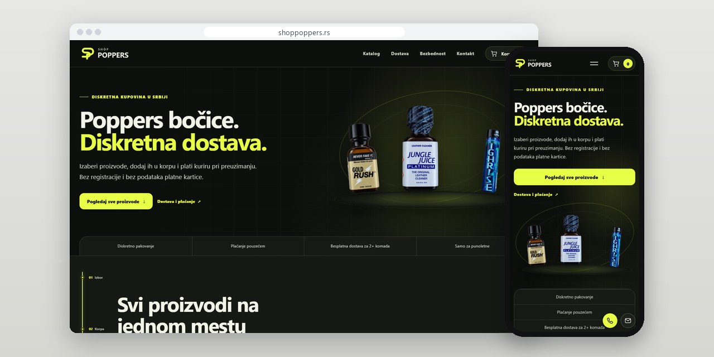
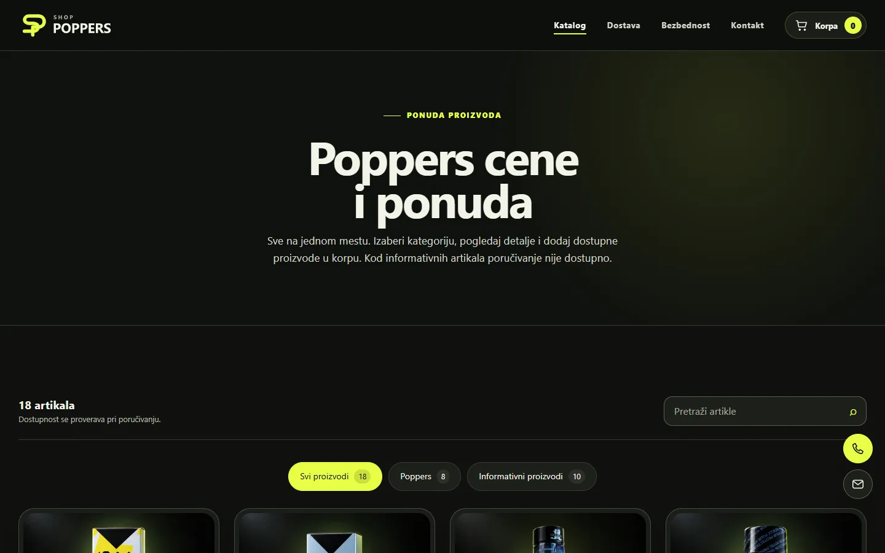
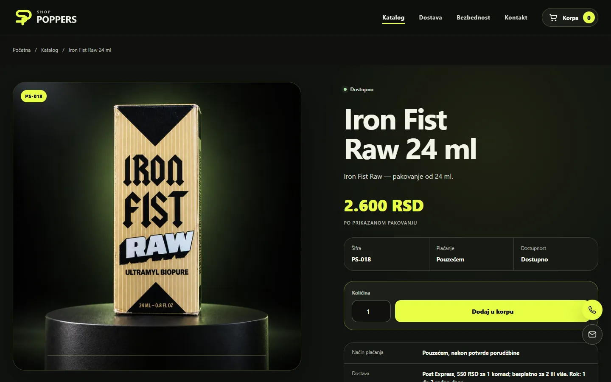

# Shop Poppers

Web shop where part of the catalogue can be ordered and the rest is listed for information only, with that rule enforced on the server.

**[shoppoppers.rs](https://shoppoppers.rs/)** · [Case study (in Serbian)](https://svilenkovic.rs/radovi/shop-poppers) · [Srpski](README.sr.md)

> [!NOTE]
> Client project. The source code belongs to the client and stays in a private repository. This page describes what I built and how.

<table>
  <tr><td><b>Client</b></td><td>Shop Poppers</td></tr>
  <tr><td><b>Industry</b></td><td>Online catalogue and shop</td></tr>
  <tr><td><b>Location</b></td><td>Serbia</td></tr>
  <tr><td><b>Type</b></td><td>Web shop</td></tr>
  <tr><td><b>My role</b></td><td>Design, development, SEO, hosting and maintenance</td></tr>
  <tr><td><b>Stack</b></td><td>PHP 8.3, MariaDB, JavaScript, nginx</td></tr>
</table>

## About the project

Shop Poppers sells across Serbia with cash on delivery. Part of its catalogue can be ordered online, while the other products are listed for information only: each has a price, a photo and its own page, but no way to buy it. The client wanted all of it to look like one collection and still behave differently.

The rule lives on the server. When a product is added to the cart, and again at checkout, the server reads the product record and accepts only items marked as orderable, so editing the HTML or sending a hand-made request opens no back door. Price, availability and delivery are read from the database again before an order is accepted, and the owner switches a product between the two states with one checkbox in the admin panel.

## What I built

- One catalogue where orderable and information-only products share the same cards, with labels and buttons that say what each one allows
- Server checks on add-to-cart and at checkout, with price, availability and delivery recalculated from the database
- A delivery rule (one item paid, two or more free) shown on the site and calculated by the server
- Cash on delivery only, so no card data is collected on the site
- An admin panel for products and orders, where one checkbox moves a product between the two states
- Product pages with their own canonical URLs, Open Graph images and structured data; cart, confirmations and admin kept out of the index

## Screenshots

<table>
  <tr>
    <td width="68%" valign="top"></td>
    <td width="32%" valign="top"></td>
  </tr>
</table>

Catalogue: orderable and information-only products in the same grid

Product page with price, availability, cart and contact

---

Built by [D. Svilenković](https://svilenkovic.com).
